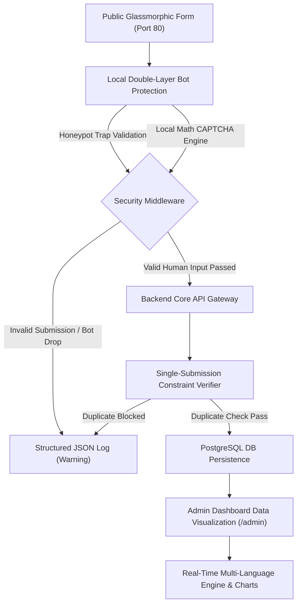

# Rainbow Lead Capture — IrisCRM

A robust, enterprise-grade monorepo system designed for secure single-submission customer registration and interactive rainbow color preference mapping.

---

## 👤 Candidate Information
- **Name:** Matheus Ferreira
- **GitHub Profile:** [matheustheus27](https://github.com/matheustheus27)
- **Application Target:** Eteg Technical Assessment Challenge

---

## 🚀 Instant Local Installation
Clone the repository securely using SSH and boot the unified reactive environment:
```bash
git clone git@github.com:matheustheus27/Rainbow-Lead-Capture.git
cd Rainbow-Lead-Capture
docker compose up --build
```

### Access Points:
- **Public Lead Capture Form (Port 80 via Nginx)**: [http://localhost](http://localhost)
- **Admin Intelligence Dashboard**: [http://localhost/#/admin](http://localhost/#/admin)
  - **Default Administrator**: `admin@iriscrm.com`
  - **Default Password**: `Admin@123`
- **Direct Backend API (Port 3000)**: [http://localhost:3000](http://localhost:3000)
- **API Healthcheck**: [http://localhost:3000/health](http://localhost:3000/health)

---

## 📊 System Architecture & Operational Workflow


---

## 📂 Project Directory Architecture
```text
Rainbow-Lead-Capture/
├── 📁 .devcontainer/
│   └── ⚙️ devcontainer.json
├── 📁 backend/
│   ├── 📄 .env.example
│   ├── 🐳 Dockerfile.dev
│   ├── ⚙️ nodemon.json
│   ├── 📦 package.json
│   ├── ⚙️ tsconfig.json
│   └── 📁 src/
│       ├── ⚡ app.ts
│       ├── 📁 config/
│       │   └── ⚡ database.ts
│       ├── 📁 controllers/
│       │   ├── ⚡ AuthController.ts
│       │   └── ⚡ CustomerController.ts
│       ├── 📁 middlewares/
│       │   └── ⚡ authMiddleware.ts
│       ├── 📁 models/
│       │   ├── ⚡ Customer.ts
│       │   └── ⚡ User.ts
│       ├── 📁 routes/
│       │   ├── ⚡ authRoutes.ts
│       │   └── ⚡ customerRoutes.ts
│       ├── 📁 services/
│       │   ├── ⚡ AuthService.ts
│       │   ├── ⚡ CaptchaService.ts
│       │   └── ⚡ CustomerService.ts
│       └── 📁 utils/
│           ├── ⚡ cpfValidator.ts
│           └── ⚡ logger.ts
└── 📁 frontend/
    ├── 🐳 Dockerfile
    ├── 🐳 Dockerfile.dev
    ├── 🌐 index.html
    ├── ⚙️ nginx.conf
    ├── 📦 package.json
    ├── 🎨 postcss.config.js
    ├── 🎨 tailwind.config.js
    ├── ⚙️ tsconfig.json
    ├── ⚙️ tsconfig.node.json
    ├── ⚙️ vite.config.ts
    └── 📁 src/
        ├── ⚛️ App.tsx
        ├── ⚛️ main.tsx
        ├── ⚙️ vite-env.d.ts
        ├── 📁 components/
        │   ├── ⚛️ Footer.tsx
        │   ├── ⚛️ GlassCard.tsx
        │   ├── ⚛️ GlassColorPicker.tsx
        │   ├── ⚛️ Input.tsx
        │   ├── ⚛️ LanguageSwitcher.tsx
        │   ├── ⚛️ MathCaptcha.tsx
        │   ├── ⚛️ Navigation.tsx
        │   ├── ⚛️ RainbowHeader.tsx
        │   ├── ⚛️ Select.tsx
        │   ├── ⚛️ StatusAlert.tsx
        │   ├── ⚛️ TextArea.tsx
        │   ├── ⚛️ ThemeSwitcher.tsx
        │   ├── 📁 admin/
        │   │   ├── ⚛️ AdminDashboard.tsx
        │   │   ├── ⚛️ ColorDistributionChart.tsx
        │   │   └── ⚛️ CustomerTable.tsx
        │   ├── 📁 auth/
        │   │   └── ⚛️ LoginView.tsx
        │   └── 📁 skeletons/
        │       ├── ⚛️ GlassSkeletonCard.tsx
        │       ├── ⚛️ GlassSkeletonTable.tsx
        │       └── ⚛️ GlassSkeletonText.tsx
        ├── 📁 context/
        │   ├── ⚛️ AuthContext.tsx
        │   ├── ⚛️ LanguageContext.tsx
        │   └── ⚛️ ThemeContext.tsx
        ├── 📁 hooks/
        │   ├── ⚡ useAdminDashboard.ts
        │   └── ⚡ useCustomerForm.ts
        ├── 📁 i18n/
        │   └── ⚡ translations.ts
        ├── 📁 services/
        │   └── ⚡ api.ts
        ├── 📁 styles/
        │   └── 🎨 index.css
        ├── 📁 types/
        │   ├── ⚙️ auth.ts
        │   └── ⚙️ customer.ts
        └── 📁 utils/
            └── ⚡ cpfMask.ts
```

---

## 🛡️ Key System Capabilities

### 1. 🤖 100% Offline Double-Layer Bot Prevention
- **Layer 1 (Invisible Honeypot Trap)**: Form includes a hidden field `website_url` (`position: absolute; left: -9999px`). Submissions containing any value are instantly rejected with `400 Bad Request` without querying the database.
- **Layer 2 (Cryptographic Math CAPTCHA)**: Dynamic arithmetic challenge generated server-side. Validated using HMAC-SHA256 tokens with short expiration timeouts (5 minutes) and replay prevention.

### 2. 🔢 Real-Time Mathematical CPF Validation
- **Check-Digit Modulo 11 Verification**: Full mathematical verification of the 10th and 11th verification digits on both frontend and backend.
- **Dynamic Masking (`000.000.000-00`)**: Real-time mask formatting as the user types, with soft green/red border feedback.

### 3. 🎨 High-Fidelity Glassmorphic UI & Color Picker
- **`GlassColorPicker`**: Translucent circular tokens with smooth hover transitions, halo glow states (`box-shadow: 0 0 16px rgba(255,255,255,0.8)`), and central checkmarks.
- **Theme Switcher**: Smooth transitions between deep dark gradients and crisp, high-contrast light glassmorphism with `localStorage` persistence.
- **High-UX Skeleton Screens**: Shimmer placeholder states mirroring form and table boundaries during data fetches.

### 4. 🌐 Dynamic Dual-Language Localization (`pt-BR` / `en`)
- **Portuguese (`pt-BR`) as Absolute Default**: Automatically pivots to English (`en`) if `navigator.language` detects an international browser locale.
- **Global `LanguageSwitcher`**: Quick toggle (`PT` | `EN`) in the navigation bar.

### 5. 📊 Admin Dashboard & Visual Analytics (`/admin`)
- **JWT Route Guards**: Bearer token authentication protecting sensitive endpoints.
- **Interactive Distribution Charts**: Real-time rainbow color distribution breakdown with proportional bars and percentage badges.
- **Lead Directory**: Live search filtering across names, CPFs, emails, notes, and color chips.

### 6. 📝 Production-Grade Structured JSON Logging
- Emits standardized single-line JSON entries to `stdout` / `stderr`:
```json
{
  "level": "info",
  "timestamp": "2026-08-16T19:55:40.123Z",
  "context": "CustomerRegistration",
  "message": "Customer lead registered successfully",
  "data": {
    "customerId": 14,
    "email": "maria@example.com",
    "favoriteRainbowColor": "Violet"
  }
}
```

---

## 📡 API Endpoint Reference

| Method | Endpoint | Description | Auth Required |
| :--- | :--- | :--- | :--- |
| `GET` | `/health` | Service and database connectivity health check | No |
| `GET` | `/captcha` | Generates a new Math CAPTCHA puzzle & HMAC token | No |
| `POST` | `/api/customers` | Registers a new lead (enforces honeypot, captcha & CPF rules) | No |
| `POST` | `/api/auth/login` | Authenticates administrator credentials & issues JWT token | No |
| `GET` | `/api/customers` | Lists all leads and analytics distribution | **Yes (JWT Bearer)** |
| `GET` | `/api/config/colors` | Exposes canonical Rainbow color list | No |

---

## 🏗️ SOLID & Clean Code Architecture

1. **Single Responsibility Principle (SRP)**:
   - `logger.ts`: Dedicated structured JSON log stream formatter.
   - `CaptchaService.ts`: Mathematical equation generation, SVG rendering, and HMAC verification.
   - `CustomerService.ts`: Core business logic, deduplication, and analytics calculations.
   - `CustomerController.ts`: Request parsing, security validation, and response mapping.
   - `cpfValidator.ts`: Pure utility function calculating CPF modulo 11 check digits.
2. **Open/Closed Principle (OCP)**:
   - Color definitions and language translation dictionaries are extensible without altering business algorithms.
3. **Interface Segregation (ISP)**:
   - Typed atomic UI components (`Input`, `TextArea`, `GlassColorPicker`, `StatusAlert`, `GlassCard`).
4. **Dependency Inversion (DIP)**:
   - Separation of database connection pool from business services.

---

## 💻 Development Onboarding with VS Code Dev Containers

1. Open this repository in **Visual Studio Code**.
2. Press `F1` and select **Dev Containers: Reopen in Container**.
3. All dependencies, extensions (ESLint, Prettier, Docker, SQLTools, Tailwind CSS), and ports (`80`, `3000`, `5432`) will initialize automatically.

---

## 📄 License & Credits
Developed by **Matheus Ferreira** — [GitHub Profile](https://github.com/matheustheus27)
